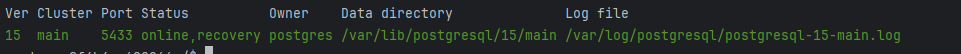

1) Физическая репликация
конфигурация контейнеров: docker/docker-compose.yml (postgres, postgres_replica)
- поменял в postgresql.conf на мастере:
    - listen_address
    
- поменял в pg_hba.conf на мастере:
    - host
    
- просмотрел кластеры на мастере:
    
- просмотрел кластеры на реплике:
    
- меняем wal level ```alter system set wal_level = replica;```:
- просмотр записей таблицы statistic на мастере ```select * from statistic```: 
  
- просмотр записей таблицы statistic на реплике ```select * from statistic```:
  
- добавляем запись в мастер ```insert into statistic VALUES ('test raw', 123, 123, 22.0)```:
- проверяем реплику через 5 минут ```select * from statistic```:
  
- вывод pg_stat_replication на мастере:
  

конфигурация мастера в папке docker/master
конфигурация реплики docker/replica
2) Логическая репликация
конфигурация контейнеров: docker/docker-compose.yml (postgres, postgres_logical)
- меняем wal level ```alter system set wal_level = logical;```:
- вручную сделал запрос для создания публикации ```CREATE PUBLICATION test_pub FOR TABLE statistic;```
- вручную подписал реплику на публикации ```CREATE SUBSCRIPTION otus_sub CONNECTION 'host=172.26.0.2 port=5432 user=postgres password=otus dbname=otus' PUBLICATION test_pub WITH (copy_data = true);``` (ip хоста подглядел в inspect контейнера - он не статичен)
- просмотр записей таблицы statistic на мастере ```select * from statistic```:
  
- просмотр записей таблицы statistic на реплике ```select * from statistic```:
  
- добавляем запись в мастер ```insert into statistic VALUES ('test raw999', 123, 123, 22.0)```:
- проверяем реплику```select * from statistic```:
    